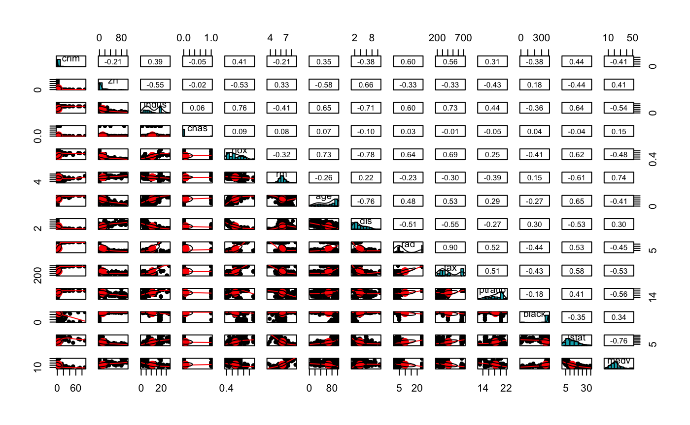

# Regression with Regularization in R

In this mini project, I create a linear regression model with regularization using R. Dataset is a housing price in boston which available [here](https://github.com/pararawendy/dibimbing-materials/blob/main/boston.csv).

## Methodology

1. Split data into train, validation and test data
2. Draw and do correlation plot to avoid multicollinearity
3. Fit models on training data using lambda [0.01, 0.1, 1, 10]<br >
   a. Ridge regression<br >
   b. LASSO
4. Choose the best lambda from the validation set
a. Use RMSE as metric
b. Interpret a sample of the coefficients of the best model<br >
   i. Ridge regression<br >
   ii. LASSO
5. Evaluate the best models on the test data<br >
   a. MAE<br >
   b. MAPE<br >
   c. RMSE

## Result

### Correlation Analysis



Interpretation:
1. Based on above figure, the only feature correlation which satisfied our above condition is a correlation between rad and tax, which is 0.90.

## Conclusion

1. Best lambda is 0,01, both using Ridge and LASSO
2. RMSE value for the validation data is 4.364 (using Ridge) and RMSE value for the test data is 6.820639
3. Here is the model with the best lambda:

```
medv = 27.82960 - 0.07879101 crim + 0.03673332 zn - 0.03849552 indus + 2.864983 chas - 0.1574647 nox + 4.531757 rm + 0.004411184 age - 1.294476 dis - 0.0002439776 tax - 0.9039250 ptratio + 0.006556538 black - 0.4764532 lstat
```


## About author

Name: Ahmad Ichsan Baihaqi

Email: ahmadichsanbaihaqi@gmail.com

Medium: https://ahmdichsanbaihaqi.medium.com/
